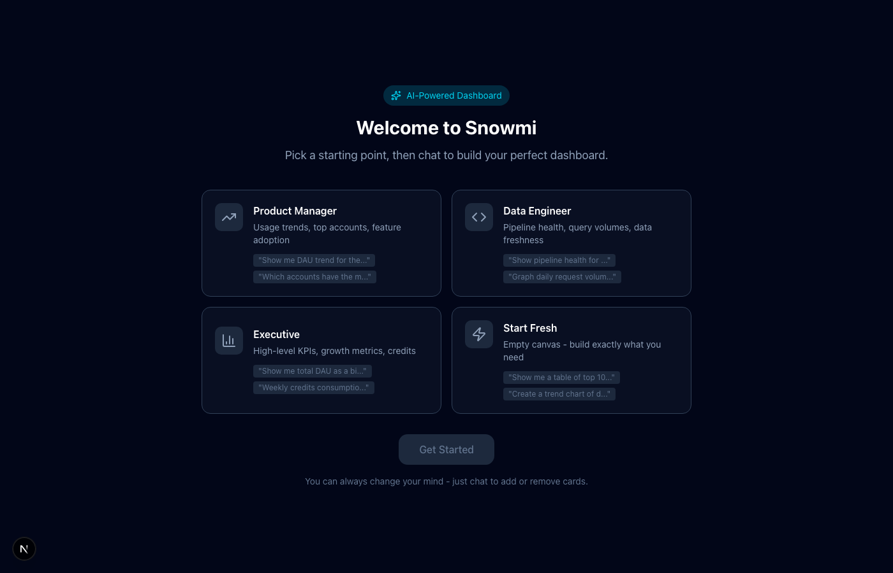
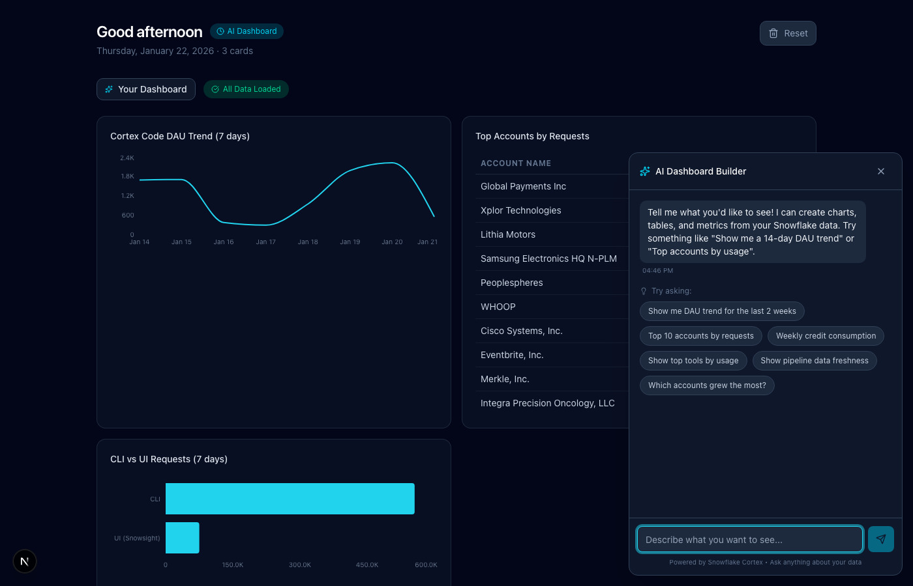

# Snowmi - AI-Powered Dashboard Builder

Build custom dashboards by chatting with AI. Powered by Snowflake Cortex.



## Features

- **Role-Based Templates**: Start with pre-built dashboards for PM, Engineer, Executive, or build from scratch
- **Natural Language → SQL**: Ask questions in plain English, get charts and tables
- **Dynamic Cards**: Trend charts, bar charts, tables, metrics - all auto-generated
- **Persistent State**: Your dashboard saves to localStorage and optionally syncs to Snowflake



## Tech Stack

- Next.js 16 with App Router + Turbopack
- TypeScript + Tailwind CSS + shadcn/ui
- Recharts for visualizations
- Snowflake Cortex AI (Claude 3.5 Sonnet) for NL→SQL
- snowflake-sdk with connection.toml auth

## Data Sources

| Table | Description |
|-------|-------------|
| `SNOWSCIENCE.LLM.CORTEX_CODE_ACCOUNT_DAY_FACT` | Daily account-level metrics |
| `SNOWSCIENCE.LLM.CORTEX_CODE_USER_DAY_FACT` | Daily user-level metrics |
| `SNOWSCIENCE.LLM.CORTEX_CODE_TOOL_USAGE` | Tool invocation data |

## Running Locally

```bash
cd snowmi
SNOWFLAKE_CONNECTION_NAME=dev npm run dev
```

Open http://localhost:3000

## Example Prompts

- "Show me DAU trend for the last 2 weeks"
- "Top 10 accounts by requests"
- "Which accounts grew the most?"
- "Show top tools by usage"

## Architecture

```
User Chat → Cortex AI → SQL Generation → Query Execution → Card Rendering
                ↓
         Card Schema (type, title, sql, config)
```

The AI interprets user requests and generates a card schema with:
- `type`: trend, bar, table, metric, status
- `title`: Human-readable card title
- `sql`: Snowflake SQL query
- `config`: Chart-specific configuration (axes, colors, etc.)
